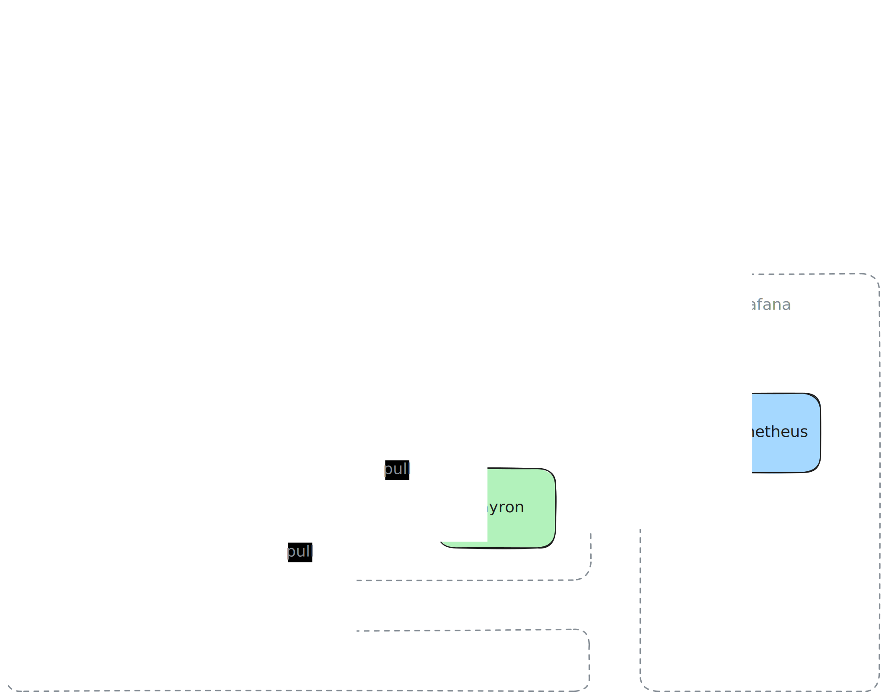

# alloy

This repository contains the pinned Docker version of [Grafana Alloy] as used in all
cloud environments.



### Configuration

All configuration and processing is defined in the [config](./config/) folder.
Separate config files can be organized for Alloy's processor pipelines for a
better overview. Note that config files must be arranged in reverse order of the
processor dependency graph. E.g. the remote write config must be the first for
Alloy to read, because remote write is the last step for our metrics to be send
to Grafana Cloud.

```
config
├── 000_remote_write.alloy
├── 001_relabel.alloy
├── 002_scrape.alloy
├── 003_discovery_cloudwatch.alloy
└── 003_discovery_dns.alloy
```

We use DNS for service discovery to scrape targets dynamically. We apply certain
relabelling operations to streamline metric labels before storing them in
Grafana Cloud. The following environment variables are required for running the
Alloy container.

- `AWS_REGION` - the AWS region of the scraped deployment infrastructure
- `ENVIRONMENT` - the environment name of the scraped deployment infrastructure
- `GRAFANA_CLOUD_API_KEY` - the API key of the Grafana Cloud metrics backend
- `PROMETHEUS_REMOTE_WRITE_URL` - the URL of the Grafana Cloud metrics backend
- `PROMETHEUS_USERNAME` - the basic auth username of the Grafana Cloud metrics backend
- `KAYRON_DISCOVERY_HOST` - the host name of the DNS discovery service for the kayron component
- `KAYRON_DISCOVERY_HOST` - the port number of the kayron components
- `SERVER_DISCOVERY_HOST` - the host name of the DNS discovery service for the server component
- `SERVER_DISCOVERY_PORT` - the port number of the server components
- `SPECTA_DISCOVERY_HOST` - the host name of the DNS discovery service for the specta component
- `SPECTA_DISCOVERY_HOST` - the port number of the specta components
- `WORKER_DISCOVERY_HOST` - the host name of the DNS discovery service for the worker component
- `WORKER_DISCOVERY_PORT` - the port number of the worker components

### Discovery

We are using the [CloudWatch Exporter] for metrics discovery of managed AWS
services like ECS containers and RDS instances. Note that it is best practice to
filter for AWS resource tags, e.g. `environment`, so that we can process metrics
for the environment that those metrics are associated with. Also note that this
requires the respective AWS resources to be tagged accordingly. Using the AWS
CLI command below we can query the available metrics names and dimension
requirements. This helps to identify the metrics that we could be interested to
scrape.

```
aws cloudwatch list-metrics --namespace "AWS/RDS" --region us-west-2
```

Piping the results from the above CLI command into `jq` may help to filter for
the metrics and their respective dimensions that we are interested in to scrape.

```
jq '[.Metrics[] | select(.Dimensions[]? | select(.Name == "Role" and .Value == "READER"))]'
```

### Releases

In order to update the Docker image, prepare all desired changes within the
`main` branch and create a Github release for the pinned Alloy version. The
release tag should align with the pinned Alloy version in [Semver Format],
following a hyphen and the short Git SHA of the release commit. Creating the
Github release triggers the responsible [Github Action] to build and push the
Docker image to the configured [Amazon ECR].

```
v1.8.3-ffce1e2
```

### Development

We use Alloy's [VS Code Extension] for syntax highlighting and formatting of the
`.alloy` config files. Just note that this extension requires the Alloy binary
to be [installed] locally in order to work properly.

[Amazon ECR]: https://docs.aws.amazon.com/ecr
[Github Action]: .github/workflows/docker-release.yaml
[Grafana Alloy]: https://grafana.com/docs/alloy/latest
[Semver Format]: https://semver.org
[VS Code Extension]: https://github.com/grafana/vscode-alloy
[installed]: https://grafana.com/docs/alloy/latest/set-up/install
[CloudWatch Exporter]: https://grafana.com/docs/alloy/latest/reference/components/prometheus/prometheus.exporter.cloudwatch
